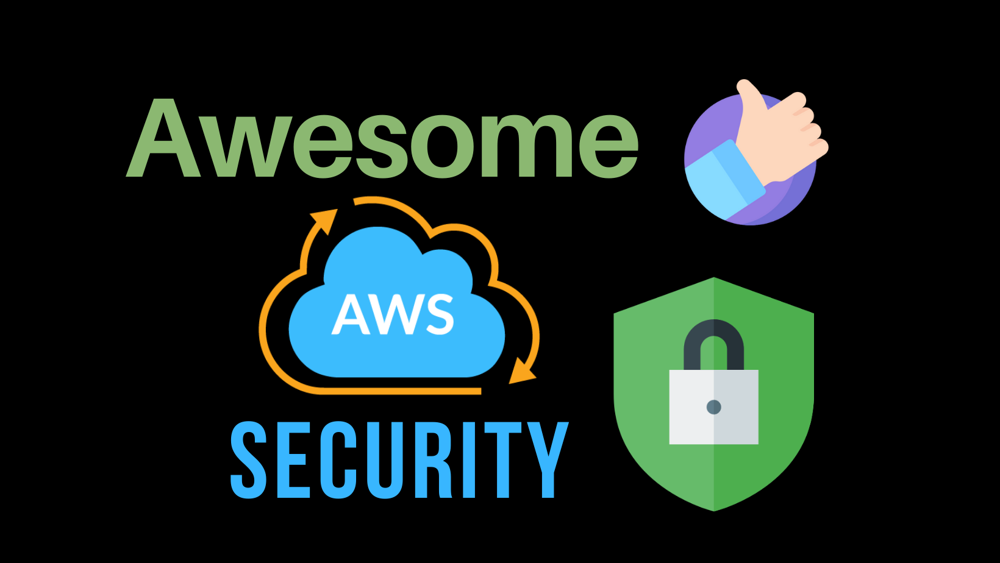

# Awesome AWS Security 

A common curated list of links, references, books videos, tutorials (Free or
Paid), Exploit, CTFs, Hacking Practices etc. which are obviously related to AWS Security.
_List inspired by the [awesome](https://github.com/sindresorhus/awesome) list thing._

## Table of Contents
[1. AWS Whitepapers](#AWS-Whitepapers)  
[2. Books](#Books)  
[3. Videos](#Videos)  
[4. Online Tutorials/Blogs/Presentations](#Online-TutorialsBlogsPresentations)  
[5. Online Courses (Paid/Free)](#Online-Courses-PaidFree)  
[6. Tools of Trade](#Tools-of-Trade)  
[7. Security Practice and CTFs](#Security-Practice-and-CTFs)  
[8. AWS Security Bulleting Important Issues](#AWS-Security-Bulleting-Important-Issues)  
[9. AWS Security Breaches](#AWS-Security-Breaches)  
[10. Contributors](#Contributors)

## AWS Whitepapers
AWS has awesome lists of whitepapers related to AWS Security. We are adding few important one here. You can anytime check more for updated or new security whitepapers [here](https://aws.amazon.com/security/security-learning/?whitepapers-main.sort-by=item.additionalFields.sortDate&whitepapers-main.sort-order=desc)

And don't forget to **bookmark AWS Security bulletin** for new vulnerabilities news from [here](https://aws.amazon.com/security/security-bulletins/)

1. [AWS Overview](https://d1.awsstatic.com/whitepapers/aws-overview.pdf) - One of the important whitepaper to understand an overview of AWS
2. [Introduction to AWS Security Whitepaper](https://docs.aws.amazon.com/whitepapers/latest/introduction-aws-security/introduction-aws-security.pdf)
3. [AWS Well-Architected Security Pillar](https://docs.aws.amazon.com/wellarchitected/latest/security-pillar/wellarchitected-security-pillar.pdf)
4. [Introduction to Security By Design](https://d1.awsstatic.com/whitepapers/compliance/Intro_to_Security_by_Design.pdf)
5. [AWS Well Architected Framework](https://d1.awsstatic.com/whitepapers/architecture/AWS_Well-Architected_Framework.pdf)
6. [AWS Risk And Compliance Whitepaper](https://d0.awsstatic.com/whitepapers/compliance/AWS_Risk_and_Compliance_Whitepaper.pdf)
7. [AWS Security Checklist](https://d1.awsstatic.com/whitepapers/Security/AWS_Security_Checklist.pdf)
8. [AWS HIPAA Compliance Whitepaper](https://d0.awsstatic.com/whitepapers/compliance/AWS_HIPAA_Compliance_Whitepaper.pdf)
9. [AWS Cloud Adoption Framework](https://d1.awsstatic.com/whitepapers/aws_cloud_adoption_framework.pdf)
10. [AWS Auditing Security Checklist](https://d1.awsstatic.com/whitepapers/compliance/AWS_Auditing_Security_Checklist.pdf)
11. [AWS CIS Foundation benchmark](https://d1.awsstatic.com/whitepapers/compliance/AWS_CIS_Foundations_Benchmark.pdf)
12. [AWS Security Incident Response](https://d1.awsstatic.com/whitepapers/aws_security_incident_response.pdf)
13. [Overview of AWS Lambda Security](https://d1.awsstatic.com/whitepapers/Overview-AWS-Lambda-Security.pdf)
14. [AWS KMS Best Practices](https://d1.awsstatic.com/whitepapers/aws-kms-best-practices.pdf)
15. [Encrypting File Data with Amazon Elastic File System](https://d1.awsstatic.com/whitepapers/Security/amazon-efs-encrypted-filesystems.pdf)
16. [Security of AWS CloudHSM backups](https://d1.awsstatic.com/whitepapers/Security/security-of-aws-cloudhsm-backups.pdf)
17. [Security overview of AWS Lambda](https://aws.amazon.com/lambda/security-overview-of-aws-lambda/)
18. [NIST Cybersecurity Framework in the AWS cloud](https://d0.awsstatic.com/whitepapers/compliance/NIST_Cybersecurity_Framework_CSF.pdf)
19. [NIST 800-144 Security and Privacy in Public Cloud Computing](https://nvlpubs.nist.gov/nistpubs/Legacy/SP/nistspecialpublication800-144.pdf)
20. [Security at the Edge: Core Principles](https://d1.awsstatic.com/whitepapers/Security/security-at-the-edge.pdf)
21. [AWS KMS Best Practices](https://d0.awsstatic.com/whitepapers/aws-kms-best-practices.pdf)
22. [Security Overview of AWS Fargate](https://d1.awsstatic.com/whitepapers/AWS_Fargate_Security_Overview_Whitepaper.pdf)

## Books
1. [Hands-On AWS Penetration Testing with Kali Linux by PackT](https://www.packtpub.com/virtualization-and-cloud/hands-aws-penetration-testing-kali-linux)
2. [Mastering AWS Security by PackT](https://www.packtpub.com/in/virtualization-and-cloud/mastering-aws-security)
3. [Security Best Practices on AWS by PackT](https://www.packtpub.com/in/virtualization-and-cloud/aws-security-best-practices-aws)
4. [Cloud Security Automation](https://www.packtpub.com/in/networking-and-servers/cloud-security-automation)
5. [AWS Automation Cookbook](https://www.packtpub.com/in/virtualization-and-cloud/aws-automation-cookbook)
6. [AWS Lambda Security Best Practices - pdf](http://www.aliencoders.org/wp-content/uploads/2020/01/AWS-Lambda-Security-eBook-1.pdf) - It's published by Puresec and it has a good overview on AWS Lambda Security Best Practices which we should follow
7. [AWS Security by Manning](https://www.manning.com/books/aws-security) - Very nice book in Progress, yet to release.
8. [Securing DevOps](https://www.manning.com/books/securing-devops) - A book which has real-world examples for Cloud Security. Must read book for any Cloud Security Professionals.
9. [Serverless Security](https://ServerlessSecurityBook.com) - An Apress book that discusses serverless security on AWS, Azure and Google Cloud.
10. [AWS Security Cookbook](https://www.packtpub.com/product/aws-security-cookbook/9781838826253)
11. [Practical Guide to Security in the AWS Cloud by SANS and sponsored by AWS Marketplace - pdf](https://pages.awscloud.com/rs/112-TZM-766/images/Cloud%20Security%20Practical%20Guide%20to%20Security%20in%20the%20AWS%20Cloud.pdf)
12. [CSA Guide to Cloud Computing by Sungress](https://www.oreilly.com/library/view/csa-guide-to/9780124201255/)
13. [Practical Cloud Security by O'reilly](https://www.oreilly.com/library/view/practical-cloud-security/9781492037507/)
14. [Effective IAM for AWS](https://www.effectiveiam.com)

## Videos
1. [The fundamentals of AWS Security](https://www.youtube.com/watch?v=-ObImxw1PmI) - Youtube
2. [AWS Security by Design](https://www.youtube.com/watch?v=I1SwoKxB13c) - Youtube
3. [Account Security with IAM](https://www.youtube.com/watch?v=9CKsX6MOPDQ) - Youtube
4. [AWS re:Inforce 2019 Security Best Practices](https://www.youtube.com/watch?v=u6BCVkXkPnM) - Youtube
5. [AWS Cloud Security Playlist](https://www.youtube.com/watch?v=N4DdqAkeqD4&list=PLxzKY3wu0_FL4VDfuCohtikXTQNTvKQVX) - Youtube
6. [A cloud security architecture workshop by RSA](https://www.youtube.com/watch?v=4TxvqZFMaoA) - Youtube
7. [AWS Cloud Security](https://www.oreilly.com/library/view/aws-cloud-security/9780135174784/) - Oreilly
8. [Introduction to AWS Security Hub](https://www.youtube.com/watch?v=o0NDi01YPXs) - Youtube
9. [Solution for flaws.cloud AWS Security Challenge](https://www.youtube.com/watch?v=VDptLO9XYbU&list=PLRTsCutScZnzo3uV_79Dur73kqskfaTMS) - Youtube Playlist
10. [AWS Security Best Practice: Well-Architected way](https://www.youtube.com/watch?v=u6BCVkXkPnM) - Youtube
11. [Hands-On With AWS Security Best Practices](https://www.youtube.com/watch?v=dabbsZ_sDX0)
12. [AWS re:Invent 2020: Security at scale: How Goldman Sachs manages network and access control](https://www.youtube.com/watch?v=5cnob8HIswY)

## Online Tutorials/Blogs/Presentations
1. [AWS Security official blog](https://aws.amazon.com/blogs/security/)
2. [AWS in Plain English](https://expeditedsecurity.com/aws-in-plain-english/)
3. [Why the CIA trusts AWS](https://mediatemple.net/blog/tips/aws-building-blocks/)
4. [Fundamentals of AWS Security](https://www.slideshare.net/AmazonWebServices/fundamentals-of-aws-security) - Presentation from AWS
5. [AWS Security primer](https://cloudonaut.io/aws-security-primer/) - Nice overview and quick run through AWS Security resources.
6. [AWS Security Blog](https://aws.amazon.com/blogs/security/)
7. [How a whitehat hacker earned $1500 in 15 minutes due to AWS S3 misconfiguration](https://medium.com/@protector47/how-i-earned-1-500-in-just-15-mins-due-to-amazon-s3-bucket-misconfiguration-953b28242f95) - It was fun going through the blog. You can learn from this article too.
8. [A deep dive into AWS S3 access control](https://labs.detectify.com/2017/07/13/a-deep-dive-into-aws-s3-access-controls-taking-full-control-over-your-assets/) - It will give a very good grip on how S3 buckets can be exploited. Lengthy but worth to go through.
9. [How Federico hacked a whole EC2 network during a penetration test](https://www.secsignal.org/en/news/how-i-hacked-a-whole-ec2-network-during-a-penetration-test/)
10. [A short blog on hacking AWS](https://www.devopsgroup.com/blog/hacking-aws-blog/) - Examples are based on cloudgoat.
11. [S3 security is flawed by design](https://www.upguard.com/blog/s3-security-is-flawed-by-design) - This article will show you why you need to be extra careful when using AWS S3.
12. [51 Tips for Security AWS(pdf)](https://www.mcafee.com/enterprise/en-us/assets/skyhigh/white-papers/wp-definitive-guide-to-aws-ebook.pdf) - McAfee
13. [The role of API gateways in API security](https://dzone.com/articles/the-role-of-api-gateways-in-api-security)
14. [Finding SSRF via HTML Injection inside a PDF file on AWS EC2](https://blog.appsecco.com/finding-ssrf-via-html-injection-inside-a-pdf-file-on-aws-ec2-214cc5ec5d90)
15. [Getting shell and data access in AWS by chaining vulnerabilities](https://blog.appsecco.com/getting-shell-and-data-access-in-aws-by-chaining-vulnerabilities-7630fa57c7ed)
16. [Hacking Serverless Runtimes - Blackhat2017](https://www.blackhat.com/docs/us-17/wednesday/us-17-Krug-Hacking-Severless-Runtimes.pdf)
17. [Detailed blog on ConsoleMe: A Central Control Plane for AWS Permissions and Access by Netflix](https://netflixtechblog.com/consoleme-a-central-control-plane-for-aws-permissions-and-access-fd09afdd60a8)
18. [Strengthen the security of sensitive data stored in Amazon S3 by using additional AWS services](https://aws.amazon.com/blogs/security/strengthen-the-security-of-sensitive-data-stored-in-amazon-s3-by-using-additional-aws-services/)
19. [Use IMDSv2 instead: Defense in depth](https://aws.amazon.com/blogs/security/defense-in-depth-open-firewalls-reverse-proxies-ssrf-vulnerabilities-ec2-instance-metadata-service/ 
)
20. [Managing permissions with grants in AWS Key Management Service](https://aws.amazon.com/blogs/security/managing-permissions-with-grants-in-aws-key-management-service/)
21. [AWS IAM Exploitation](https://sra.io/blog/aws-iam-exploitation/)
22. [S3 Pentest by Rhino Security Labs](https://rhinosecuritylabs.com/penetration-testing/penetration-testing-aws-storage/)
23. [How an Attacker Could Use Instance Metadata to Breach Your App in AWS](https://www.mcafee.com/blogs/enterprise/cloud-security/how-an-attacker-could-use-instance-metadata-to-breach-your-app-in-aws/)
24. [Orca Security Research Team Discovers AWS CloudFormation Vulnerability](https://orca.security/resources/blog/aws-cloudformation-vulnerability/)
25. [Orca Security Research Team Discovers AWS Glue Vulnerability](https://orca.security/resources/blog/aws-glue-vulnerability/)
26. [How I Discovered Thousands of Open Databases on AWS](https://infosecwriteups.com/how-i-discovered-thousands-of-open-databases-on-aws-764729aa7f32)
27. [CVE-2022-25165: Privilege Escalation to SYSTEM in AWS VPN Client](https://rhinosecuritylabs.com/aws/cve-2022-25165-aws-vpn-client/)
28. [Downloading and Exploring AWS EBS Snapshots](https://rhinosecuritylabs.com/aws/exploring-aws-ebs-snapshots/)
29. [Weaponizing AWS ECS Task Definitions to Steal Credentials From Running Containers](https://rhinosecuritylabs.com/aws/weaponizing-ecs-task-definitions-steal-credentials-running-containers/)
30. [Good Read on AWS IAM Privilege Escalation – Methods and Mitigation](https://rhinosecuritylabs.com/aws/aws-privilege-escalation-methods-mitigation/)
31. [One more on IAM Privilege Escalation](https://payatu.com/blog/mayank.arora/iam_privilege_escalation_attack)
32. *[A very good repo for learning IAM based vulnerabilities](https://github.com/BishopFox/iam-vulnerable)
33. [AWS Penetration Testing: Step by step guide](https://www.hackthebox.com/blog/aws-pentesting-guide)

## Online Courses (Paid/Free)
1. [AWS Fundamentals: Address Security Risks](https://www.coursera.org/learn/aws-fundamentals-addressing-security-risk) - Coursera
2. [Cloud Computing Security](https://www.coursera.org/learn/cloud-computing-security) - Coursera
3. [AWS: Getting started with Cloud Security](https://www.edx.org/course/aws-getting-started-with-cloud-security) - EdX
4. [AWS Certified Security Specialty](https://www.udemy.com/course/aws-certified-security-specialty/) - Udemy by Zeal Vora
5. [AWS Certified Security Specialty](https://acloud.guru/learn/aws-certified-security-specialty) - From Acloud.guru
6. [AWS Certified Security Specialty](https://www.udemy.com/course/ultimate-aws-certified-security-specialty/) - Udemy by Stephan Maarek
7. [AWS Certified Security Specialty](https://www.whizlabs.com/aws-certified-security-specialty/) - From WhizLabs
8. [AWS Advanced Security](https://www.udemy.com/course/aws-advanced-security/) - Udemy
9. [AWS Security Path](https://www.appsecengineer.com/product/aws-security) - AppSecEngineer
10. [AWS for Architects: Advanced Security](https://www.linkedin.com/learning/aws-for-architects-advanced-security/) - Linkedin Learn by Lynn Langit
11. [Practical Event Driven Security with AWS](https://acloud.guru/learn/practical-event-driven-security-with-aws) - Acloud.guru
12. [Learning Path for AWS Security](https://learn.acloud.guru/learning-path/aws-security) - Nicely designed the learning path who wants to be an AWS Security Experts from Acloud.guru
13. [Cloud Hacking course](https://www.notsosecure.com/hacking-training/cloud-hacking/) - From NotSoSercure
14. [Breaking and Pwning Apps and Servers in AWS and Azure](https://github.com/appsecco/breaking-and-pwning-apps-and-servers-aws-azure-training) - Previously an instructor led training now released as free and open source courseware for Cloud Pentesters
15. [AWS Skill Builder platform security learning plan](https://explore.skillbuilder.aws/learn/public/learning_plan/view/91/security-learning-plan) - AWS SkillBuilder
16. [Cloud Security: AWS Edition Bootcamp by Pentester Academy](https://bootcamps.pentesteracademy.com/course/cloud-security-aws-on-demand) - From Pentester Academy
17. [Cloud Security BootCamp by Kaizenteq](www.cloudsecuritybootcamp.com) - Monthly FREE Cloud Security Bootcamps From Kaizenteq

## Tools of Trade
1. [AWS Security Products - Official](https://aws.amazon.com/products/security/) - Few Important tools that you should consider are:
    * 1.1 **AWS IAM:** AWS Identity and Access Management (IAM) enables you to manage access to AWS services and resources securely
    * 1.2 **CloudWatch:** CloudWatch is the AWS monitoring tool
    * 1.3 **CloudTrail:** AWS CloudTrail is a service that enables governance, compliance, operational auditing, and risk auditing of your AWS account
    * 1.4 **AWS Inspector:** AWS inspector is a security assessment service that does vulnerability and best-practice scanning for AWS applications
    * 1.5 **Amazon GuardDuty:** GuardDuty is a managed threat detection service that is simple to deploy, and scales with your infrastructure
    * 1.6 **AWS KMS:** AWS KMS is a secure and resilient service that uses hardware security modules that have been validated under FIPS 140-2
    * 1.7 **AWS Shield:** AWS Shield is a managed DDoS protection service. AWS Shield can protect EC2, Load balancers, CloudFront, Global Accelerator, and Route 53 resources
    * 1.8 **AWS Trusted Advisor:** AWS Trusted Advisor is an online tool that provides you real time guidance to help you provision your resources following AWS best practices
    * 1.9 **AWS Config:** AWS Config is a service that enables you to assess, audit, and evaluate the configurations of your AWS resources
    * 1.10 **Security Hub:** AWS Security Hub gives you a comprehensive view of your high-priority security alerts and security posture across your AWS accounts
    * 1.11 **AWS WAF:** AWS WAF is a web application firewall that helps protect your web applications or APIs against common web exploits that may affect availability, compromise security, or consume excessive resources
    * 1.12 **AWS Macie:** Macie is all about protecting data. It is a machine learning service that watches data access trends and finds anomalies to spot data leaks and unauthorized data access.
    * 1.13 **AWS Detective:** Amazon Detective automatically collects log data from your AWS resources and uses machine learning, statistical analysis, and graph theory to build a linked set of data that enables you to easily conduct faster and more efficient security investigations.
    * 1.14 **AWS Conformance Packs:** A conformance pack is a collection of AWS Config rules and remediation actions that can be easily deployed as a single entity in an account and a Region or across an organization in AWS Organizations. [conformance packs on github](https://github.com/awslabs/aws-config-rules/tree/master/aws-config-conformance-packs)
2. [Arsenal of AWS Security Tools](https://github.com/toniblyx/my-arsenal-of-aws-security-tools) - Collection of all security category tools and products
3. [AWS Security Automation](https://github.com/awslabs/aws-security-automation) - Collection of scripts and resources for DevSecOps and Automated Incident Response Security
4. [truffleHog](https://github.com/dxa4481/truffleHog) - Searches through git repositories for high entropy strings and secrets, digging deep into commit history
5. [gitleaks](https://github.com/zricethezav/gitleaks) - Audit git repos for secrets
6. [AWS Security Benchmark](https://github.com/awslabs/aws-security-benchmark) - Open source demos, concept and guidance related to the AWS CIS Foundation framework.
7. [S3 Inspector](https://github.com/kromtech/s3-inspector) - Tool to check AWS S3 bucket permissions
8. [ScoutSuite](https://github.com/nccgroup/ScoutSuite) - Multi-Cloud Security Auditing Tool
9. [Prowler](https://github.com/toniblyx/prowler) - AWS Security Best Practices Assessment, Auditing, Hardening and Forensics Readiness Tool.
10. [AWS Vault](https://github.com/99designs/aws-vault) - A vault for securely storing and accessing AWS credentials in development environments
11. [AWS PWN](https://github.com/dagrz/aws_pwn) - A collection of AWS penetration testing junk
12. [Pacu](https://github.com/RhinoSecurityLabs/pacu) - AWS Penetration Testing Toolkits
13. [Zeus](https://github.com/DenizParlak/Zeus) - AWS Auditing and Hardening tool
14. [Cloud Mapper](https://github.com/duo-labs/cloudmapper) - Analyze your AWS environments (Python)
15. [ConsoleMe](https://github.com/Netflix/consoleme) - A Central Control Plane for AWS Permissions and Access
16. [AWS Firewall Factory](https://github.com/globaldatanet/aws-firewall-factory) - Deploy, update, and stage your WAFs while managing them centrally via FMS.
17. [AWS Pentesting/Red Team Methodology - by hacktricks](https://cloud.hacktricks.xyz/pentesting-cloud/aws-pentesting) - A Collection for AWS environment penetration testing methodology.
18. [AWS Pentesting/Red Team Methodology - by hackingthe.cloud](https://hackingthe.cloud/aws/general-knowledge/aws_organizations_defaults/) - A collection of attacks/tactics/techniques that can use by offensive security professionals during cloud exploitation.
19. [CloudFox](https://github.com/BishopFox/cloudfox) - Automating situational awareness for cloud penetration tests
20. [aws-lint-iam-policies](https://github.com/welldone-cloud/aws-lint-iam-policies) - Tool to find problems in identity-based and resource-based IAM policies

## Security Practices and CTFs
1. [AWS Well Architected Security Labs](https://wellarchitectedlabs.com/security/)
2. [Flaws to learn common mistakes in AWS through challenge](http://flaws.cloud/)
3. [Flaws2 focuses on AWS security concepts through various challenge levels](http://flaws2.cloud/)
4. [CloudGoat By Rhino Security Labs](https://github.com/RhinoSecurityLabs/cloudgoat) - Vulnerable by Design AWS infrastructure setup tool
5. [OWASP ServerlessGoat](https://github.com/OWASP/Serverless-Goat) - OWASP ServerlessGoat is a deliberately insecure realistic AWS Lambda serverless application maintained by OWASP for educational purposes.
6. [OWASP WrongSecrets](https://github.com/commjoen/wrongsecrets) - OWASP WrongSecrets is a vulnerable app which shows you how to not store secrets. It covers code, Docker, Kubernetes, and AWS cloud bad practices.
7. [AWS S3 CTF Challenges with solutions](https://n0j.github.io/2017/10/02/aws-s3-ctf.html)
8. [AWS CTF with practical scenario](https://r00tz-ctf.awssecworkshops.com/)
9. [Breaking and Pwning Apps and Servers on AWS and Azure by AppSecCo](https://github.com/appsecco/breaking-and-pwning-apps-and-servers-aws-azure-training) - The training covers a multitude of scenarios taken from our vulnerability assessment, penetration testing and OSINT engagements which take the student through the journey of discovery, identification and exploitation of security weaknesses, misconfigurations and poor programming practices that can lead to complete compromise of the cloud infrastructure.
10. [AWS Workshop official](https://awsworkshop.io/) - This is not exactly security part, but would be helpful to understand AWS with this workshop examples.
11. [AWS Security Workshops](https://awssecworkshops.com/) by AWS
12. [ThreatModel for Amazon S3](https://github.com/trustoncloud/threatmodel-for-aws-s3) - Library of all the attack scenarios on Amazon S3 and how to mitigate them, following a risk-based approach
13. [AWS Cloud Quest: Security Role](https://explore.skillbuilder.aws/learn/course/external/view/elearning/7636/cloud-quest)
14. [AWS Jam Journey: Security](https://explore.skillbuilder.aws/learn/course/external/view/elearning/9284/aws-jam-journey-security)
15. [TryHackMe: Attacking and Defending AWS](https://resources.tryhackme.com/attacking-and-defending-aws)
16. [Free AWS Security Labs](https://pentesting.cloud/)
17. [Black Sky Cloud Labs from HTB](https://www.hackthebox.com/business/professional-labs/cloud-labs-blacksky)
18. [CloudFoxable](https://cloudfoxable.bishopfox.com/) - Create your own vulnerable by design AWS penetration testing playground 

## AWS Security Bulletin Important Issues
1. [Container Networking Security Issue ([CVE-2020-8558])](https://nvd.nist.gov/vuln/detail/CVE-2020-8558) (This issue may allow containers running on the same host, or adjacent hosts (hosts running in the same LAN or layer 2 domain), to reach TCP and UDP services bound to localhost (127.0.0.1))
2. [Minimum Version of TLS 1.2 Required for FIPS Endpoints by March 31, 2021](https://aws.amazon.com/security/security-bulletins/AWS-2020-001/)
3. [Unencrypted md5 plaintext hash in metadata in AWS S3 Crypto SDK for golang](https://github.com/google/security-research/security/advisories/GHSA-76wf-9vgp-pj7w)
4. [CBC padding oracle issue in AWS S3 Crypto SDK for golang](https://github.com/google/security-research/security/advisories/GHSA-f5pg-7wfw-84q9) : [CVE-2020-8911](https://nvd.nist.gov/vuln/detail/CVE-2020-8911)
5. [In-band key negotiation issue in AWS S3 Crypto SDK for golang](https://github.com/google/security-research/security/advisories/GHSA-7f33-f4f5-xwgw) : [CVE-2020-8912](https://nvd.nist.gov/vuln/detail/CVE-2020-8912)
6. [CVE-2018-15869](https://nvd.nist.gov/vuln/detail/CVE-2018-15869): An Amazon Web Services (AWS) developer who does not specify the --owners flag when describing images via AWS CLI, and therefore not properly validating source software per AWS recommended security best practices, may unintentionally load an undesired and potentially malicious Amazon Machine Image (AMI) from the uncurated public community AMI catalog.
7. [How a Security Researcher found 1000s of open databases on AWS](https://infosecwriteups.com/how-i-discovered-thousands-of-open-databases-on-aws-764729aa7f32)

## AWS Security Breaches
1. [AWS Security breaches - 2017](https://www.sumologic.com/blog/aws-security-breaches-2017/)
2. [200 million voters data leak](https://www.skyhighnetworks.com/cloud-security-blog/latest-voter-data-leak-is-a-lesson-in-aws-security/) - A lesson in AWS Security
3. [Imperva blames data breach on Stolen AWS API keys](https://www.zdnet.com/article/imperva-blames-data-breach-on-stolen-aws-api-key/)
4. [Tesla's Amazon cloud account was hacked and used to mine cryptocurrency](https://www.businessinsider.in/finance/teslas-amazon-cloud-account-was-hacked-and-used-to-mine-cryptocurrency/articleshow/63003345.cms)
5. [10 worst Amazon S3 breaches](https://businessinsights.bitdefender.com/worst-amazon-breaches)
6. [Lion Air the Latest to Get Tripped Up by Misconfigured AWS S3](https://www.darkreading.com/attacks-breaches/lion-air-the-latest-to-get-tripped-up-by-misconfigured-aws-s3-/d/d-id/1335864)
7. [Online Fashion App 21 buttons Exposes Financial Records of Top European Influencers due to S3 misconfiguration](https://www.vpnmentor.com/blog/report-21-buttons-breach/)
8. [Capital One Cloud data breach due to S3 misconfiguration](https://rhinosecuritylabs.com/aws/capital-one-cloud_breach_s3-cloudgoat/)
9. [Online Fashion App 21 buttons Exposes Financial Records of Top European Influencers](https://www.vpnmentor.com/blog/report-21-buttons-breach/)
10. [Utah COVID-19 testing service exposes 50,000 patients’ photo IDs, personal info on the web](https://www.comparitech.com/blog/information-security/utah-covid-test-center-leak/)
11. [US municipalities suffer data breach due to misconfigured Amazon S3 buckets](https://www.securitymagazine.com/articles/95704-us-municipalities-suffer-data-breach-due-to-misconfigured-amazon-s3-buckets)

## AWS Security Podcast/Newsletter
1. [Cloud Security Podcast - YouTube](https://www.youtube.com/@CloudSecurityPodcast/videos) - Weekly Interviews with Cloud Security Professionals on AWS, Azure, GCP Security for Blue Teams & Red Teams
2. [Cloud Security Newsletter](https://www.cloudsecuritynewsletter.com/) - Weekly Cloud Security Nuggets in your inbox

## Contributors
[Please refer the guidelines at contribute.md for details](Contribute.md).

Thanks to the following folks who made contributions to this project.

**Get your name listed here**

[List of Contributors](https://github.com/jassics/awesome-aws-security/graphs/contributors)
